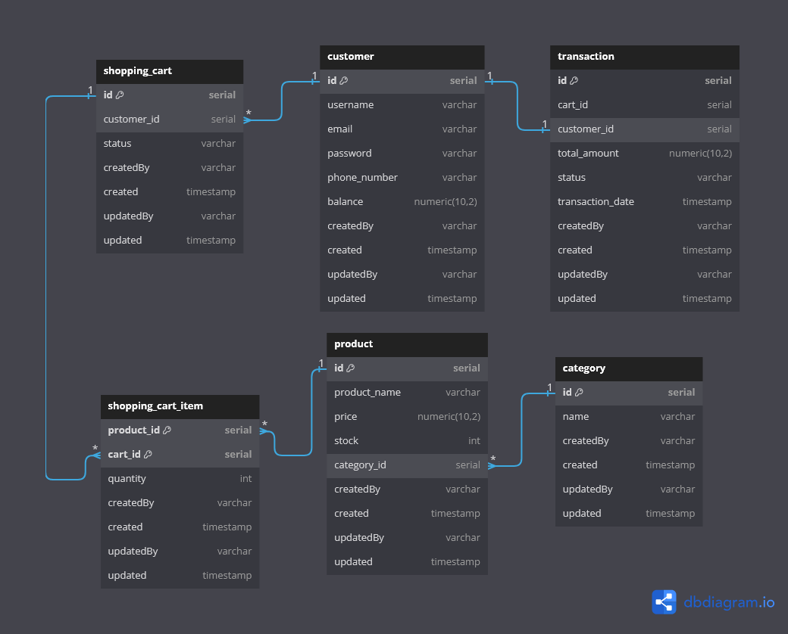

# Simple Commerce Backend

A backend-focused e-commerce API built with Go, Gin, PostgreSQL, Redis, RabbitMQ, and Docker. The project models the core commerce flow from account registration and email verification to product catalog management, cart operations, order creation, payment transaction handling, and structured request logging.

This repository is designed as a portfolio-grade backend project: it highlights service boundaries, database-first business rules, async messaging, containerized local development, and a roadmap toward load testing and observability.

## What It Does

Simple Commerce exposes REST APIs for:

- Customer and seller registration
- Email verification with activation codes
- Login, refresh token, and logout flows
- Customer and seller lookup
- Category and product management
- Product filtering, cursor-style pagination, and stock updates
- Shopping cart item management
- Order creation, order detail lookup, listing, and cancellation
- Transaction creation, payment callback handling, and transaction expiration


## Why This Exists

Most small commerce APIs stop at CRUD. This project goes further by modeling backend concerns that matter in production systems:

- Separating handlers, services, repositories, DTOs, and models by business module
- Keeping business rules in service layers instead of HTTP handlers
- Using PostgreSQL constraints and transactional writes for order and payment consistency
- Reserving and releasing inventory around order and transaction state changes
- Hashing refresh tokens before persistence
- Using RabbitMQ for asynchronous email verification workflows
- Adding Redis-backed rate limit infrastructure
- Sending request logs to Loki through middleware
- Running the application and infrastructure through Docker Compose

## Tech Stack

- **Language:** Go
- **HTTP framework:** Gin
- **Database:** PostgreSQL
- **Cache / rate limit storage:** Redis
- **Message broker:** RabbitMQ
- **Logging pipeline:** Loki and Promtail
- **Authentication:** JWT access tokens and hashed refresh tokens
- **Local development:** Docker Compose and Air

## Architecture

The codebase is organized around domain modules under `internal/`:

```text
internal/
  auth/          registration, login, refresh token, email verification
  user/          customer and seller lookup
  catalog/       categories, products, inventory
  cart/          shopping cart and cart items
  order/         order lifecycle and stock reservation
  transaction/   payment transaction lifecycle
  email/         email service and RabbitMQ queue integration
  middleware/    error handling, request id, logging, rate limiting

package/
  db/            PostgreSQL and Redis clients
  rabbitmq/      RabbitMQ client bootstrap
  logging/       Loki client and logger wrapper
  response/      response envelopes and error mapping
  util/          token and utility helpers
```

Each feature follows a similar flow:

```text
HTTP route -> handler -> service -> repository -> PostgreSQL
```

Cross-cutting concerns such as request IDs, error mapping, and Loki request logging are handled through middleware so feature handlers can stay focused on request parsing and response delivery.

## Core Design Decisions

### Modular Backend Boundaries

The API is split by business capability rather than by technical layer alone. Auth, catalog, cart, order, and transaction each own their route, handler, service, repository, DTO, and model files. This keeps changes localized and makes the project easier to review as it grows.

### Transactional Order Flow

Order and transaction services use database transactions where state changes must stay consistent. The order flow reserves inventory, writes order records, and can release stock when transactions fail, expire, or orders are cancelled.

### Inventory Concurrency Control

Inventory records track `stock_quantity`, `reserved_quantity`, and `version`. Repository updates check available stock before reserving items, which protects against overselling during concurrent order creation.

### Token Lifecycle

Authentication uses short-lived JWT access tokens and persisted refresh tokens. Refresh tokens are hashed before storage, and logout revokes the stored token instead of relying only on client-side deletion.

### Async Email Verification

Registration creates activation codes and publishes verification email jobs through RabbitMQ when available. If the queue is unavailable, the service can fall back to direct email handling so registration does not depend on broker availability.

### Observability Foundation

The app attaches request IDs, sends request metadata to Loki, and exposes Prometheus metrics through `GET /metrics`. Docker Compose includes Loki and Promtail so the project can evolve toward production-style log aggregation.

The Prometheus middleware records:

- `http_requests_total`
- `http_request_duration_seconds`
- `http_requests_in_flight`

Metrics use low-cardinality labels for `method`, `route`, and `status`. Route labels are based on Gin route patterns, such as `/api/v1/product/:id`, instead of raw URL paths.

## Database Model

The current schema is defined in `new_db.sql` and includes:

- `customers` and `sellers`
- `activation_codes` and `refresh_tokens`
- `categories`, `products`, and `inventories`
- `shopping_carts` and `cart_items`
- `orders` and `order_items`
- `transactions`
- `email_queues`

The schema uses UUID primary keys for main business entities, unique constraints for email/SKU/order/transaction identity, check constraints for valid statuses, and relational constraints between commerce entities.

## API Overview

| Area | Endpoint examples |
| --- | --- |
| Auth | `POST /api/v1/auth/customer/register`, `POST /api/v1/auth/seller/register`, `GET /api/v1/auth/login`, `POST /api/v1/auth/refresh-token`, `POST /api/v1/auth/logout` |
| Email verification | `GET /api/v1/auth/verify-email?code=...` |
| Customer | `GET /api/v1/customer/by-email`, `GET /api/v1/customer/by-id` |
| Seller | `GET /api/v1/seller/by-name` |
| Product | `POST /api/v1/product`, `GET /api/v1/product`, `GET /api/v1/product/:id`, `PUT /api/v1/product/:id`, `DELETE /api/v1/product/:id`, `PATCH /api/v1/product/:id/stock` |
| Category | `POST /api/v1/category`, `GET /api/v1/category`, `GET /api/v1/category/:id` |
| Cart | `GET /api/v1/cart`, `POST /api/v1/cart/items`, `PUT /api/v1/cart/items`, `DELETE /api/v1/cart/items/:product_id`, `DELETE /api/v1/cart/items` |
| Order | `POST /api/v1/orders`, `GET /api/v1/orders`, `GET /api/v1/orders/:id`, `PATCH /api/v1/orders/:id/cancel` |
| Transaction | `POST /api/v1/transactions`, `GET /api/v1/transactions/:id`, `GET /api/v1/transactions/by-order/:order_id`, `POST /api/v1/transactions/callback`, `PATCH /api/v1/transactions/:id/expire` |

## Run Locally With Docker

Create a `.env` file in the project root with these variables:

```env
POSTGRES_DB=simple_commerce
POSTGRES_USER=postgres
POSTGRES_PASSWORD=postgres
REDIS_PASSWORD=redis-password
RABBITMQ_USER=guest
RABBITMQ_PASSWORD=guest
JWT_SECRET=change-this-secret
APP_BASE_URL=http://localhost:8080
```

Start the application and supporting services:

```bash
docker compose up --build
```

The API runs on:

```text
http://localhost:8080
```

Health endpoints:

- `GET /healthz`: liveness check for the HTTP process
- `GET /readyz`: readiness check for PostgreSQL and Redis connectivity

Supporting services:

- PostgreSQL: `localhost:5432`
- Redis: `localhost:6379`
- RabbitMQ AMQP: `localhost:5672`
- RabbitMQ Management UI: `http://localhost:15672`
- Loki: `http://localhost:3100`
- Prometheus: `http://localhost:9090`
- Grafana: `http://localhost:3000`

## Observability

Prometheus metrics are exposed at:

```text
GET http://localhost:8080/metrics
```

The endpoint includes request count, request duration, and in-flight request metrics grouped by HTTP method, Gin route pattern, and status code.

Prometheus scrapes `/metrics` periodically, and Docker can call health endpoints periodically. The application HTTP metrics and Loki request logger intentionally skip `/metrics`, `/healthz`, and `/readyz`. This keeps dashboard traffic, latency, and endpoint breakdown panels focused on user/API requests instead of operational probe traffic.

Docker Compose also runs Prometheus and Grafana for local performance investigation:

```text
Gin API /metrics -> Prometheus -> Grafana dashboard
```

Prometheus scrapes the API through `monitoring/prometheus/prometheus.yml`. Grafana is provisioned automatically from `monitoring/grafana/provisioning`, so the Prometheus datasource and the dashboard are available without clicking through the UI.

Access:

- Grafana: `http://localhost:3000`
- Login: `admin` / `admin`
- Dashboard: `Simple Commerce / Simple Commerce Backend Observability`
- Prometheus: `http://localhost:9090`

Dashboard coverage:

- Request throughput, total requests, and in-flight requests
- P50, P95, P99, and average response time
- Error rate, 4xx, 5xx, and failed request trends
- Go runtime metrics: goroutines, memory, heap, GC, and CPU
- Process metrics: RSS memory, open file descriptors, uptime, and CPU
- Endpoint breakdown by volume, latency, and errors

Dashboard filters:

- Environment
- Instance
- Endpoint route
- HTTP status code

Dashboard preview:

```text
docs/images/grafana-dashboard-preview.png
```

To validate the monitoring stack:

```bash
docker compose up --build -d
docker compose ps
```

Open Prometheus targets at `http://localhost:9090/targets` and confirm `simple-commerce-api` is `UP`. Generate a few requests against the API, for example:

```bash
curl http://localhost:8080/metrics
curl http://localhost:8080/api/v1/product
```

Then open Grafana at `http://localhost:3000`. The dashboard should auto-load and start showing traffic, latency, runtime, and process panels after Prometheus has scraped at least once.

Important PromQL patterns used by the dashboard:

- `rate(http_requests_total[1m])` shows current request throughput per second.
- `increase(http_requests_total[5m])` shows recent request volume for load-test windows.
- `histogram_quantile(0.95, sum by (le) (rate(http_request_duration_seconds_bucket[5m])))` calculates latency percentiles from the request duration histogram.
- `100 * errors / total` calculates error percentage from 4xx and 5xx responses.
- `rate(process_cpu_seconds_total[5m])` estimates app CPU consumption from exported process metrics.

## Run Locally With Air

If you prefer running the Go process outside Docker:

```bash
go install github.com/air-verse/air@latest
air init
air
```

Keep PostgreSQL, Redis, and RabbitMQ running through Docker Compose, or provide equivalent local services through your own setup.

## Makefile Commands

Common project commands are available through `make`:

```bash
make help
make run
make dev
make build
make test
make tidy
make docker-up
make docker-down
make docker-logs
make k6-smoke
```

Useful targets:

| Command | Purpose |
| --- | --- |
| `make run` | Run the API with `go run .` |
| `make dev` | Run the API with Air hot reload |
| `make build` | Build the local binary into `bin/` |
| `make build-linux` | Build a Linux amd64 binary |
| `make build-windows` | Build a Windows amd64 binary |
| `make test` | Run all Go tests |
| `make fmt` | Format Go packages |
| `make vet` | Run `go vet` |
| `make tidy` | Clean up Go module dependencies |
| `make docker-up` | Start app and infrastructure with Docker Compose |
| `make docker-up-d` | Start Docker Compose services in detached mode |
| `make docker-down` | Stop Docker Compose services |
| `make k6-smoke` | Run lightweight k6 smoke test |

## Testing The API

Recommended manual test flow:

1. Register a customer or seller.
2. Verify the email using the generated activation code flow.
3. Login and store the returned access and refresh tokens.
4. Create categories and products as a seller.
5. Add products to a customer cart.
6. Create an order from cart items.
7. Create a transaction for the order.
8. Send a payment callback and verify order, transaction, and inventory state changes.

## k6 Smoke Test

The smoke test is a lightweight pre-flight check before running heavier future performance tests. It validates service health, readiness, critical read endpoints, a safe write/error contract, and the Prometheus metrics endpoint.

Run smoke test:

```bash
k6 run tests/k6/smoke.js
```

Or through Make:

```bash
make k6-smoke
```

With custom base URL:

```bash
k6 run -e BASE_URL=http://localhost:8080 tests/k6/smoke.js
```

Coverage:

- `GET /healthz`
- `GET /readyz`
- `GET /api/v1/product?limit=5`
- `GET /api/v1/category`
- `POST /api/v1/auth/refresh-token` with an intentionally invalid payload
- `GET /metrics`

Purpose:

- Validate service health and dependency readiness.
- Validate critical endpoint behavior.
- Confirm the system is ready before future performance testing.

## Catalog Browsing Load Test: v1 vs v2

This benchmark compares catalog product read performance between:

| Version | Endpoint | Purpose |
| --- | --- | --- |
| v1 | `/api/v1/product` | Baseline non-cached product read endpoint |
| v2 | `/api/v2/product` | Redis cached product read endpoint |

The k6 scenario simulates product browsing:

| Action | Weight |
| --- | ---: |
| Product list | 50% |
| Product list by category | 30% |
| Product detail by UUID | 20% |

Before running the test, make sure this file contains valid product UUIDs:

```text
tests/k6/fixtures/catalog-fixture.js
```

Run v1 baseline:

```bash
make k6-load-v1-100
make k6-load-v1-300
make k6-load-v1-500
make k6-load-v1-1000
```

Run v2 Redis cached benchmark:

```bash
make k6-load-v2-100
make k6-load-v2-300
make k6-load-v2-500
make k6-load-v2-1000
```

Use the same dataset, same VU count, same duration, and same script for v1 and v2.
Only the endpoint version changes.

## Observability And Load Testing Roadmap

Planned improvements:

- Add k6 scenarios for registration, catalog browsing, cart, order, and payment flows.
- Export application metrics for request latency, error rate, queue publishing, and transaction outcomes.
- Add Prometheus and Grafana dashboards for API health and throughput.
- Add structured business events for order and transaction lifecycle changes.
- Add integration tests around stock reservation, order cancellation, payment success, and transaction expiry.

## ERD



## Repository Notes

- `new_db.sql` contains the current normalized schema used by the Go repositories.
- `db.sql` is an older schema draft kept for reference.
- `docker-compose.yaml` starts the app plus PostgreSQL, Redis, RabbitMQ, Loki, and Promtail.
